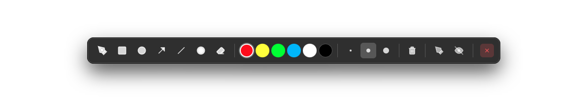

# Marko



A cross-platform desktop application for drawing annotations directly on top of your screen. Built with Electron, this tool is perfect for live presentations, online classes, demos, and screen recordings.

> **Note:** This application was entirely developed by artificial intelligence (Claude by Anthropic) through conversational prompts.

## Features

### Drawing Tools

- **Pen** - Freehand drawing
- **Rectangle** - Draw rectangles and squares
- **Circle/Ellipse** - Draw circles and ellipses
- **Arrow** - Draw arrows with arrowheads
- **Line** - Draw straight lines
- **Laser Pointer** - Red dot pointer for presentations
- **Eraser** - Erase annotations

### Toolbar Features

- Draggable toolbar (drag from any empty area)
- Always stays on top of other windows
- Hide from screen recordings (toolbar hidden, annotations visible)
- Color palette with 6 colors (Red, Yellow, Green, Blue, White, Black)
- 3 stroke width options (Thin, Medium, Thick)
- Clear canvas button

### Keyboard Shortcuts

| Shortcut       | Action                    |
| -------------- | ------------------------- |
| `Ctrl+Shift+P` | Pen tool                  |
| `Ctrl+Shift+R` | Rectangle tool            |
| `Ctrl+Shift+O` | Circle/Ellipse tool       |
| `Ctrl+Shift+A` | Arrow tool                |
| `Ctrl+Shift+L` | Line tool                 |
| `Ctrl+Shift+I` | Laser Pointer             |
| `Ctrl+Shift+E` | Eraser tool               |
| `Ctrl+Shift+D` | Toggle drawing mode       |
| `Ctrl+Shift+C` | Clear canvas              |
| `Ctrl+Shift+H` | Toggle overlay visibility |
| `Ctrl+Shift+T` | Show/focus toolbar        |
| `Ctrl+Z`       | Undo                      |
| `Ctrl+Shift+Z` | Redo                      |

_On macOS, use `Cmd` instead of `Ctrl`_

## Installation

### Prerequisites

- Node.js (v16 or higher)
- npm

### Setup

```bash
# Clone or navigate to the project directory
cd marko

# Install dependencies
npm install

# Run the application
npm start
```

## Building for Distribution

```bash
# Build for macOS
npm run build:mac

# Build for Windows
npm run build:win

# Build for Linux
npm run build:linux
```

Built packages will be available in the `dist` folder.

## Platform Support

- **macOS** - Full support including hide from screen capture
- **Windows** - Full support including hide from screen capture
- **Linux** - Full support (hide from screen capture may vary by distribution)

## Use Cases

- Live presentations and demos
- Online teaching and classes
- Screen recording annotations
- Video tutorials
- Code reviews and walkthroughs
- Remote collaboration

## Technical Details

- Built with Electron 28+
- Transparent overlay window for annotations
- Separate toolbar window with content protection
- Canvas-based drawing engine
- IPC communication between windows
- Global keyboard shortcuts

## System Tray

The application runs in the system tray with quick access to:

- Show Toolbar
- Toggle Drawing
- Show/Hide Overlay
- Clear Canvas
- Quit

## License

MIT
